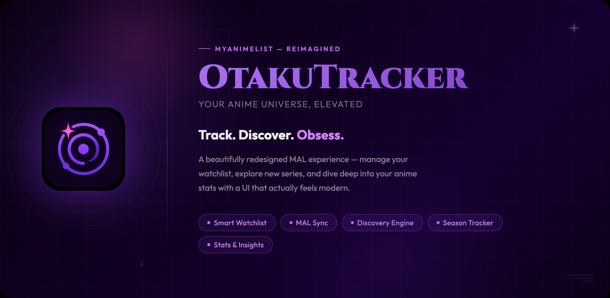

<div align="center">
  <a href="otakutracker_feature_graphic.html">
    
  </a>
</div>

---

A Flutter application that provides a revamped UI for MyAnimeList (MAL), letting users browse seasonal anime, manage their watchlist, and track their viewing progress.

---

## Features

### Home
- Reorderable carousels for current season, previous season, leftover anime, top upcoming, top airing, and most popular
- Tap any card to open the full anime details page

### Seasonal Browser
- Browse anime by past, current, or upcoming season
- Infinite-scroll paginated grid
- Pull-to-refresh

### My List
- Full watchlist synced from MyAnimeList
- Filter by status: Watching, Completed, On-Hold, Dropped, Plan to Watch
- Sort by: Last Updated, Title, Score, Progress
- Toggle between poster grid view and detail list view
- Pull-to-refresh

### Anime Details
- Hero section with poster, metadata chips (type, status, episodes, season), score panel, and statistics
- Synopsis, background, and genre tags
- Related anime and recommendations
- Add/update list entry (status, score, episode progress) directly from the details page
- NSFW content gating

### Profile
- MAL avatar and username
- Anime statistics: episodes watched, days watched, mean score
- Watchlist breakdown by status category
- NSFW content toggle
- Logout

### General
- MyAnimeList OAuth2 login
- Deep link support for navigating to anime details from external sources
- Skeleton loading states throughout
- Material Design 3 with dark theme
- Firebase Analytics, Crashlytics, and Performance monitoring

---

## Prerequisites

- [Flutter SDK](https://flutter.dev/docs/get-started/install) (Dart ≥ 3.4.3)
- A MyAnimeList account
- A MyAnimeList API client ID ([create one here](https://myanimelist.net/apiconfig))

---

## Setup

1. **Clone and install dependencies:**
   ```bash
   git clone https://github.com/your-username/otaku-tracker.git
   cd otaku-tracker
   flutter pub get
   ```

2. **Run with your MAL client ID:**
   ```bash
   flutter run --dart-define=MALAPI=your_mal_client_id_here
   ```

3. **Build for release:**
   ```bash
   flutter build apk --dart-define=MALAPI=your_mal_client_id_here
   flutter build ios --dart-define=MALAPI=your_mal_client_id_here
   ```

> The app reads the client ID via `String.fromEnvironment('MALAPI')` at build time. Never commit your key to version control.

---

## Project Structure

```
lib/
├── constants/          # App-wide constants, helpers, and navigation utilities
├── models/             # Data models and DTOs
├── pages/              # Top-level screens (home, seasonal, my list, anime details, profile)
├── providers/          # Riverpod state providers
├── services/           # Business logic, API access, caching, and telemetry
└── widgets/            # Reusable UI components
    ├── anime/          # Poster cards and carousels
    ├── anime_details/  # All components for the anime details page
    ├── my_list/        # Watchlist tiles, detail view, controls sheet
    └── shared/         # App bar, bottom nav, skeletons, error states, user avatar
```

---

## Key Dependencies

| Package | Purpose |
|---|---|
| `flutter_riverpod` | State management |
| `go_router` | Declarative navigation and deep linking |
| `jikan_api` | MyAnimeList API v2 wrapper |
| `oauth2` + `flutter_web_auth_2` | MAL OAuth2 authentication |
| `shared_preferences` | Token and preference persistence |
| `firebase_analytics` / `firebase_crashlytics` | Telemetry and error reporting |
| `firebase_performance` | Network and trace performance monitoring |
| `flutter_animate` | Animations |
| `carousel_slider` | Horizontal carousels on the home screen |
| `app_links` | Deep link handling |
| `fluttertoast` | In-app toast notifications |

---

## License

This project is private and not intended for public distribution.
